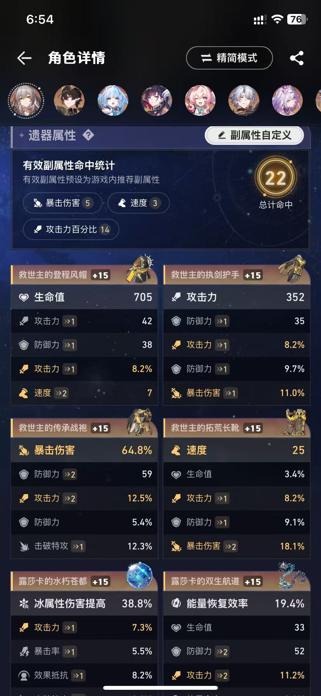
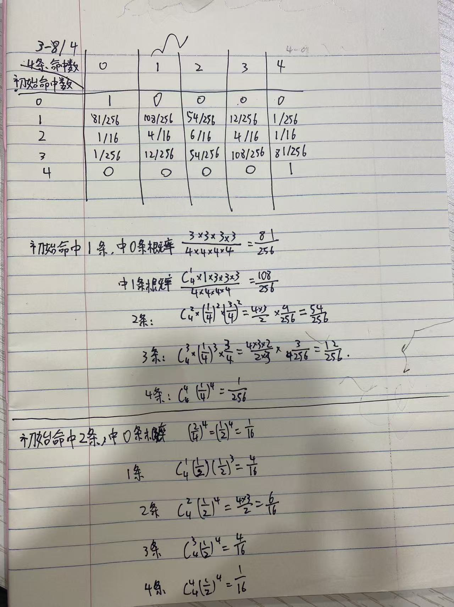
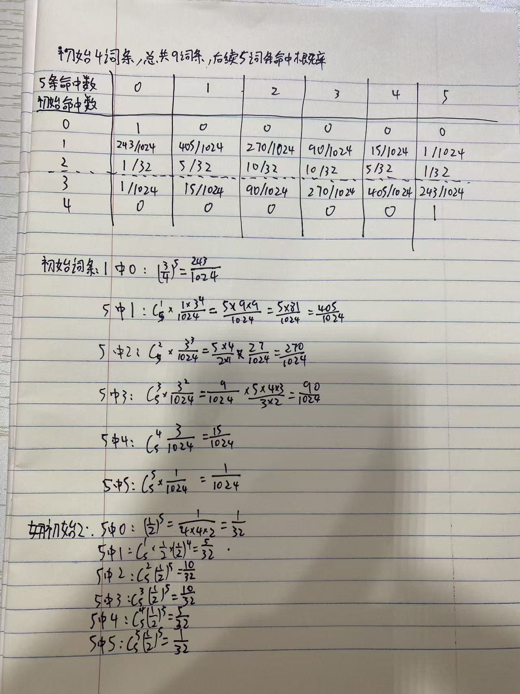

# 基于python代码制作的星铁遗器刷取分析建议

## 写在最开始的唠嗑

因为有相当一段时间打星铁都是低功耗状态（仅清每日体力，以及在版本活动剧情结束前打完活动剧情），体力什么的都是打完就行。

所以存了快55罐体力，最近忽然就又有研究游戏的心情了（清明放假咯~虽然写出这个的时候明天就要返工惹……），随之而来的就想着把体力燃料用了。

那么就自然而然地产生了一个问题，**这些体力打什么本能最大化提升角色装备有效词条数量**呢？

刚好清明三天假，闲来没事决定抽风，开干~

## 本项目的目的

本项目可以读取**预输入的角色遗器信息**，通过分析遗器现有词条数量与其有效主/副词条的情况，给出每个部位，每个套装，每个角色的遗器刷取后的**词条优化概率**。


比如现有词条数量为6，通过本项目能得知不同角色刷取对应副本后最终获取7及以上数量的词条的遗器的概率。

## 版本更新日志
v1.0 项目初版搭建完成 2026/4/8
v1.1 将结果输出至excel，提升可用性 2026/4/19
v2.0 更新了多角色同一遗器本的提升概率计算，现在计算的更准确了. 2026/5/17

## 使用方法
**考虑到大部分人应该只对怎么使用感兴趣，遂将使用方法写在最前面**

如果你有兴趣研究并进行后续二次开发，下面会放我代码的大概思路，也会对为什么这么做进行一定的解释。相信如果你如果具有二次开发的能力的话，
我的文档应该能为你提供一定的帮助。

注：作者不会代码打包，所以若想使用本项目代码您可能需要自行研究如果在自己电脑上运行Python代码，谢谢！

### 文档结构
1. main.py：主程序
2. math_cal.py: 该文件主要储存副词条计算概率的方法，在main.py文件中存在该文件的引用
3. 星铁装备刷取.xlsx: 该文件里有三个表格“角色遗器、主词条分布、遗器相关”，其中角色遗器和遗器相关的表是有用的。
4. pic文件夹：这个文件夹仅用来放置readme.md介绍文件里面的图片
5. README.md:本文件，用来进行代码的基础使用说明

### 快速使用

#### 1.填写信息

在“星铁装备刷取.xlsx”的表格里面的“角色遗器”里照抄需要你需要进行遗器词条分析的角色们的相关信息。
1. **角色名称**：抄写角色名称，这个角色名称会在后续输出时显示角色名称，当然也可以自己给其写外号，比如Archer我就给他顺手打了红A的名字。
2. **遗器套装名称**：这里写角色外圈的名称，如果想打全名也可以打类似“沉陆海域的露莎卡”的名称。 
3. 如果想打简称则需要在表格中“遗器相关”里面在对应的全名后面输入简称，如果一件装备有多个简称（外号）则使用【、】（啊，没错，中文顿号）隔开。
4. 角色外圈套装可以支持2+2的组合，两个名字之间采用【+】加号隔开
5. **内圈套装名称**：内圈装备名称
6. **有效词条数量**：用于说明后续有效词条种类的数量（我记得这个变量好像没啥用来着，似乎？）
7. **有效词条**：不同词条顺序不分先后，多个词条使用【、】隔开。这个有效词条会在后续副词条分析中用于辨认不同的有效词条，该副词条请务必参照下述名称进行输入。
8. **副词条名称列表**（程序只认识该名称）：小生命、小攻击、小防御、大生命、大攻击、大防御、速度、暴击、暴伤、效果抵抗、效果命中、击破
9. **衣服/鞋子/球/绳子主词条**:填写角色所需要所需部位对应的主词条，主词条名称也请根据对应填写。
10. **主词条名称列表**：治疗量、冰伤、火伤、物伤、虚数伤害、量子伤、雷伤、风伤。（此处仅填写副词条中没有的部分）
11. **头/手/衣服/鞋子/球/绳子**的有效词条数量：这里需要自行数数计算各部位的有效词条数量，用于后续计算该部位如果想要有效词条数量更多的遗器的概率。 

#### 2.运行main.py

python main.py

#### 3.得到结果
最后结果输出分为两类四种。
两类是从角色角度、刷取角度分析提升概率。

结果分为四种（结果已输出至excel中，在运行main.py后可在【分析结果.xlsx】中查看结果）：
##### 角色套装刷取优化概率
从角色的角度分析，某一角色刷取其外圈或内圈， 其任一部位刷取一次时能得到满级强化后有效词条数量多于当前部位有效词条数量的概率。

考虑到单纯的看概率都是小数点后好几位，不了解其具体意义。遂提供了90%期望出货概率与数量。

如下，盾丹的90%概率期望出货次数为3811，意味着刷取隐士套3811次后，有90%的概率能得到比现在盾丹词条更好的遗器。
（不是，我盾丹遗器词条这么好吗？？？哦，不对，盾丹的有效词条总数少）

```bibtex
('四件套-自匿星芒的隐士', '盾丹', 0.0006040890809216443) 90.0 %概率期望出货次数 3811
('两件套-劫火莲灯铸炼宫', '忘归人', 0.0008652397392996531) 90.0 %概率期望出货次数 2661
('四件套-骇域漫游的信使', '知更鸟', 0.017969866216899836) 90.0 %概率期望出货次数 127
('两件套-出云显世与高天神国', '大黑塔', 0.01831919045311449) 90.0 %概率期望出货次数 125
```
##### 角色部位刷取优化概率
如果说你只想关注某一角色的某一部位还有多少提升空间，则可以看这个结果。

结果展示了 特定角色-特定套装-特定部位 的获取满级强化后有效词条数量多于当前部位有效词条数量的概率。

注：期望出货次数被限定在了10000，如果次数抵达这个数字并不意味着只需要1w次就有90%概率获取更好的遗器，
而是我把期望上限限制在了1w次。（写代码到今天就懒得用数学优化计算了，这个是while循环硬算的）

如下，姬子老师的追击套的手部当前有效词条数量为6，理论上限是9（这个理论上限都是9，有问题但不影响懒得修了），
期望出货次数492。

理论上刷他492次，492*40/240=82天，也就是差不多三个月就有90%的概率得到一个更好的姬子老师的套装手了！（也太绝望了）

```bibtex
('两件套-盗贼公国塔利亚-绳子', '阮梅', 0.00012488355863177588, 6, 9) 90.0 %概率期望出货次数 10000
('四件套-毁烬焚骨的大公-手部', '姬子', 0.004677096133999823, 6, 9) 90.0 %概率期望出货次数 492
('两件套-泛银河商业公司-绳子', '老杨', 0.08581620639795269, 0, 9) 90.0 %概率期望出货次数 26
('四件套-净庭教宗的圣骑士-头部', '杰帕德', 0.08933374748797615, 3, 9) 90.0 %概率期望出货次数 25
```

##### 套装刷取优化概率
从角色的角度分析刷取概率得到的结果都太绝望了，每个角色动不动就要刷取几十上百成千次才能有优化。

所以决定从遗器套装的角度进行强化分析，将所有使用同一套装的角色并在一起，将其所有的套装优化概率加起来就是该套装刷取的优化概率。

（当然只是简单相加其实并不准确，毕竟会有角色的毕业词条一样，意味着出一件满级装备只能给一个人，而非概率翻倍。
但简单计算差不多了，加起来就这样吧。）

从这个角度就能看出来哪些套装都有哪些角色有所需求，一眼认出来哪些套装的使用者都有谁，也容易辨认出哪些套装使用者多。

通过这个权重就能看出来更应该刷取哪个套装（人要有大爱，不能就盯着版本大C/辅助去刷装备，这样希儿会哭的）

比如看看萨尔索图（每次都喊他萨尔图），有“真理、银枝、彦青、托帕、希儿、saber、姬子”辣么多人需要这个两件套，
这些角色加起来让理论上优化概率叠加到0.1494313567223295去了，甚至只需要15次就能得到其中角色的一次词条进步。（期待）

```bibtex
('盗贼公国塔利亚', 7.976547261806324e-05, '阮梅、') 90.0 %概率期望出货次数 10000
('妖精织梦的乐园', 0.0005984761269625793, '白厄、') 90.0 %概率期望出货次数 3847
('不老者的仙舟', 0.06487434346977737, '花火、白露、符玄、罗刹、') 90.0 %概率期望出货次数 35
('停转的萨尔索图', 0.1494313567223295, '真理、银枝、彦青、托帕、希儿、saber、姬子、') 90.0 %概率期望出货次数 15
```


##### 刷取地点刷取优化概率

继套装刷取优化，毕竟遗器本都是有两个套装的，那为什么不以遗器本为单位计算一下遗器本的词条进步概率呢？

所以以遗器本为单位，如果遗器本内两个套装都有使用者的话就会计算概率。

比如‘萨尔图’的本里‘百年冻土’里只有萨尔图这个套装有用，所以就只计算了萨尔图的进步概率。

而'浴火钢心'这个本里“盗贼公国塔利亚+生命的翁瓦克”两个都有用，于是就加起来了。

```bibtex
0 ('浴火钢心', 0.0032190084500973238, '盗贼公国塔利亚+生命的翁瓦克+', '阮梅、椒丘、') 90.0 %概率期望出货次数 715
1 ('隐救之径', 0.0076750033655329005, '再创天地的救世主+自匿星芒的隐士+', '记忆主、盾丹、') 90.0 %概率期望出货次数 299
21 ('坚城不倒', 0.06487434346977737, '不老者的仙舟+', '花火、白露、符玄、罗刹、') 90.0 %概率期望出货次数 35
22 ('百年冻土', 0.1494313567223295, '停转的萨尔索图+', '真理、银枝、彦青、托帕、希儿、saber、姬子、') 90.0 %概率期望出货次数 15
```


## 引言

回归本项目的正题，为了解决 “这些体力打什么本能最大化提升角色装备有效词条数量”这个问题，需要一部分的可行性分析。

### 问题是否有解
首先第一步思考这个问题是否能得出一个答案。

答案肯定是可以的。有规律的东西总是有迹可循，就算是随机的东西也能被统计学常态下统计出分布来进行分析，更别说游戏这里面这些肯定存在规律的了。

从信息的角度来看，在米游社中可以获取每个我已经有的角色的遗器信息（主词条，副词条中有效数量，有效词条数量，有效词条等），
这意味着我可以知道当前我的所有角色的基本状态信息。

其次，每件遗器的刷取概率是可知的（在指定本中有两套装，每次刷取获得2-3金），其中每金里两个套装的理论出现概率相同，其次每个套装里出现部位概率相同
（外圈四件套四分之一，内圈两件套二分之一），每个部位主词条出现概率也有大佬研究总结过了，那么问题就只剩下了一个。

在已知某遗器部位+主词条固定情况下出现的概率。怎么分析**有效副词条的出现概率**和后续**强化到有效词条的概率**来计算不同总有效词条数的遗器出现概率。

而这个问题虽然有些复杂，但一眼过去不就是概率问题嘛，我觉得可以，所以决定开干。

## 流程

既然问题存在答案，那么接下来要做的就是怎么找到这个答案。

### 1.读取角色信息

其实最开始是有想说要不看看能不能读取米游社的角色遗器信息，这样就不需要自己一方面把信息填写进excel表格里，
另一方面还要写python代码读取excel表格读取数据。

但想了想还是不要增加额外工作量了，如果只是分析数据分析概率我还能保证清明三天能搞定项目，但是再多任务大概率项目就没开始就流产了哈哈哈。

#### 1.1 记录角色信息
所以最后，需要人工将米游社里角色遗器信息填写进excel表格内部。

米游社角色遗器信息查询渠道：右下角我的——中间横条游戏里选择星铁——中间我的角色里点击查看更多——然后就是这个界面查看信息了




在这里可以看到有效词条都有哪些，角色主词条都是哪些，每个部位有效词条数量又是多少这些，对着这个界面就能填写excel所需的信息了。

#### 1.2 读取excel表格信息

main.py里面的`read_excel_character_info(excel_file_path)`方法读取角色信息。

通过输入excel路径，调用`exchang_character_info()`方法将每行的角色信息转化为`character_equip`的类。

在转化完的最后调用`character_equip`类中的`update_info()`方法将所有遗器的简称更新为全名。

最后返回`character_equip`类的list。

具体实现看代码~

### 2.分析角色遗器信息

#### 2.1 初始化
##### 2.1.1 副词条信息初始化
`init_equip_main_dict()`进行一些主词条概率的词典的初始化，记录每个部位的不同主词条出现的概率

`init_equip_res_dict()`对副词条权重进行初始化，用于后续副词条的概率计算

##### 2.1.2 遗器信息的初始化
`read_excel_equip_info(excel_file_path)`里面通过读取excel表格里面遗器套装的刷取位置信息建立字典映射，
然后也读取每个遗器本的简称和全程的对应关系，用来后面读取角色信息后将简称转化为全称。

#### 2.2 分析角色遗器套装信息
前面1.2里面读取了遗器信息，得到了角色信息的类的list
```bibtex
# 读取Excel文件
character_info_list=read_excel_character_info(excel_file_path)
```
然后将信息`character_info_list`传入`update_character_equip_anylize(character_info_list)`方法里，
单独对每个角色的遗器词条进行分析。

分析则是调用`equip_anylize()`方法进行单个部位的概率分析。
输入该部位的主词条，角色有效词条种类的list，角色当前有效词条数量，该部位名称（头/手/等等）
返回该部位获取最终满级强化后0-9有效词条的概率分布。


#####  2.2.1 equip_anylize()遗器部位基本分析

影响单词刷取后获取遗器指定部位满级强化后不同有效词条概率的影响因素有以下几种：有效词条种类（包括数量），主词条概率，无效副词条种类，
部位位置（四件套某一位置的出货概率为0.25，而两件套则是0.5），出金数量

在这里，概率计算为：P=P_{副词条影响}*主词条出现概率 *部位概率（四件套0.25，两件套0.5）*出金概率(1.05)

其中P_{副词条影响}的计算则通过`equip_anylize_cal(use_list,res_list)`方法调用
math_cal.py里面的`cal_p()`方法了。

而`cal_p()`方法的输入则是有效词条种类和无效词条种类（以及副词条权重字典）。

为什么不直接使用有效词条种类和副词条种类（12种），此处则是考虑到由于主词条会出现副词条会出现的词条。

如主词条若是大攻击，那么可选择的副词条就不是12种，而是除了大攻击以外的11种。

所以将主词条从待选副词条列表里删除，再将有效词条和无效词条分开传参，可以将不同部位的副词条分析问题统一为副词条的分析问题。
这样有的遗器副词条总数是12还是11就不影响后续的计算了。

##### 2.2.2 cal_p()副词条有效词条数量概率分布分析

`cal_p(use_name_list,res_name_list,equip_name_weight_dict)` 是遗器满级强化后副词条里总有效词条数量分析的方法

该方法对于副词条总数的分析分为两部分：
1. 获取遗器后，四个初始词条里不同有效词条数量的概率分布
2. 计算在已知初始四词条里有效词条数量的基础上，求其4次强化和5次强化里后续命中有效词条数量的分布。

**首先关于初始3词条与4词条的问题**：
    
最开始寻思着强化后3/6/9/12/15级各多一个词条，一共会多出5个词条。

但是初始3词条在第一次强化时是多一个词条，而不是在已有词条里选择一个强化，就纠结了一会。

但转念一想，3词条的最终归宿是3+5=8词条。4词条则是4+5=9词条。

换个思路就是两种情况就不能变成两个都是初始4词条，先把词条选上了。然后初始3词条就是强化4次，4词条强化5次。

这样就从类别问题（第一次强化多一个不同的词条/在已有词条里选一个强化）就分开成数量问题。

###### 2.2.2.1 计算初始4词条情况下，不同有效词条数量的概率分布

`cal_eff_when_init4(use_name_list,res_name_list,equip_name_weight_dict)`通过这个方法输入有效词条种类，
无效词条种类，词条权重字典来获取初始有效词条数量的概率分布。

最终输出为长度为5的np.array，毕竟有效词条数量范围是【0，4】,然后概率加起来总和为1.

此部分原理解释起来较为复杂，先pass

###### 2.2.2.2 在给定初始词条的情况下，不同强化次数的有效词条数量概率分布

这个问题其实是个数学问题，在跳过原理解释后总结下来就是。

在不同数量的初始有效词条数量的基础上，对于4/5次强化，最终强化命中次数的概率是可以计算成表的。

表格与部分计算过程如下所示，回头有机会再慢慢说明计算过程和思路吧（难说有没有这个回头）。






然后有了初始词条的有效词条数量的概率分布（2.2.2.1）以及不同有效词条数量基础上后续强化的概率分布，
组合上3/4词条出现频率就能算出来出现最终强化完后，总有效词条数量的概率分布了。

储存3词条和4词条出现概率的字典`e_equip34`再math_cal.py文件内,出现初始3词条概率为0.8，4词条为0.2

p=0.8*初始4词条有效词条数量概率分布 *强化4次命中有效词条数量概率分布+0.2 *初始4词条有效词条数量概率分布 *强化5次命中有效词条数量概率分布

就能得到在给定初始**有效词条种类**和**无效词条种类**基础上获取有效词条数量的概率分布了

#### 2.3 套装信息储存位置

顺带一提，所有的角色遗器有效词条数量的概率分布储存在角色类的`eq4_anylize`和`eq2_anylize`里面了

### 3.输出遗器信息分析结果

#### 3.1 以角色为核心的遗器词条优化概率
前面一通计算完，最后计算出来的概率分布又储存回了角色信息的`eq4_anylize`和`eq2_anylize`里面。

`show_character_equipment_list(character_info_list)`该方法还是通过输入角色信息，
调取角色信息里面的最终有效词条数量的概率分布，然后一个个部位对应其当前有效词条数量，去统计不同部位的词条优化概率。

比如某一角色头部有效词条数量为6，同时计算得到其最终副词条有效词条概率分布为
[0.1,0.1,0.1,0.1,0.1,0.1,0.1,0.1,0.1,0.1]。 

那么想要获得更好词条就只能获取7/8/9个有效词条，而获取7/8/9有效词条的概率分别为0.1/0.1/0.1，
那么这个部位最终刷取时的**提升概率**就是0.1+0.1+0.1=**0.3**。
（当然这里只是展示效果，实际上这里忽略了主词条概率，部位概率等概率。）

然后就是根据角色情况，将角色部位的词条提升概率相加得到角色的套装提升概率；以及将角色部位单独列表得到部位提升概率。


#### 3.2 以套装为核心的遗器词条优化概率
而在上面计算获得角色套装概率的基础上，通过
`load_character_to_equipment(character_info_list)`方法将角色-套装的关联关系变成套装-角色的关联关系，
进而统计同一套装不同角色的提升概率。

再进而将同一地点的两个套装综合计算提升概率，最后得到一个提升的排序。


### 总结

好的，算法流程介绍完毕，大概就这样了？

最终产出了这么个角色装备分析的方法，希望对大家刷取能提供选择帮助？

不过其实刷取装备倒也简单来着，想给谁刷词条就给谁刷词条，像我这样把所有角色都放一起提升一个整体的估计也不多2333

给一些不上场的角色刷词条，既没办法在打深渊时提升主C练度，也没办法增强辅助可能多动一次。

但是吧，备战未来？抽都抽了，这些环境都不让角色上场了，我们还不给角色一些存在感就这么仓管着感觉也不太好。
多少让他们也有所提升，增加点存在感吧，毕竟也是曾经的C啊……


